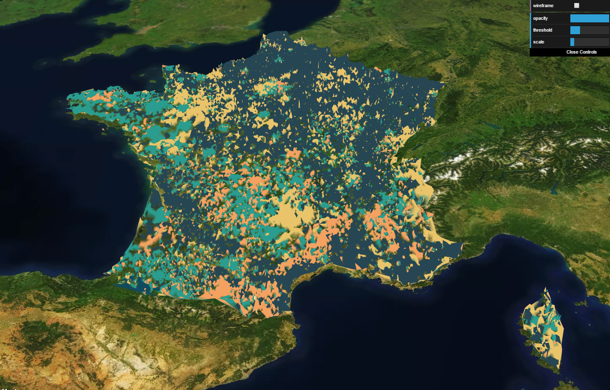

# elections_2017
3D mapping of the results of the first round of the french presidential elections 2017

### foreword

this experiment is a "one-trick pony", a quick a dirty experiment done in a day.
after the [opendotlab workshops about cartography](http://www.opendotlab.it/it/content/cityai), we ended up with a nice illustration of [AirB'nB prices variations over time](https://github.com/opendot/airbnb) .
this uses the same principle / code.

I wanted to see what the results of the french presidential election would look like city by city. the elevations represent the percentage of voices each candidate collected in a given city.
unfortunately the DOM-TOM couldn't be represented as I couldn't find a clean spreadsheet of their locations and / or said locations would not render properly.
all apologies for that, especially as we do have the results and that, at the time of writing, these territories are living through unprecedented social unrest.

I'm not a data scientist, I'm not sure if the precentage of voters is the most relevant metric or if is the right way to display the resluts and/or if there would be a better way to do this.
to be honest, I don't really care :)

all the data are processed realtime, this may take a while to load as they're not optimized at all.

you can check the online [demo](http://www.barradeau.com/2017/170425/elections/#5.85/45.297/3.739/0/43)

about the controls:

* check/uncheck the boxes on the left, to make a candidate's result visible or hidden

top right panel

* **wireframe** changes the maeshes display (more of a gimmick really)
* **opacity** controls the opacity of the meshes
* **threshold** filters the minimum percentage of votes from which a result is displayed
* **scale** changes the elevation scale

the colors are hardcoded, I could'nt think of a meaningful set of colors, there's lots of room for imporvement on that side too.

### libraries used
[threebox](https://github.com/peterqliu/threebox) which uses [MapBoxGl.js](https://www.mapbox.com/mapbox-gl-js/api/) under the hood.
NB: to use the demo, you'll have to specify your Mapbox TOKEN in the config.js file.
you'll therefore need a MapBox profile to get this token.

### data sources
[Les données des élections](https://www.data.gouv.fr/fr/posts/les-donnees-des-elections/)
[Liste des villes de France en SQL, CSV ou XML](http://sql.sh/736-base-donnees-villes-francaises)
[natural earth: Admin 0 – Countries](http://www.naturalearthdata.com/downloads/10m-cultural-vectors/10m-admin-0-countries/)